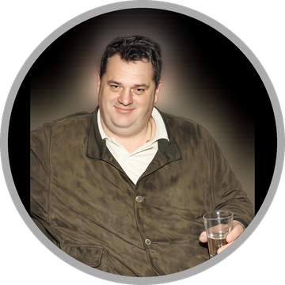

# Bay Mile

<p align="center">
  
</p>

**Bay Mile** *(бай Миле)* is a small, educational **reinforcement-learning chess
engine** built on the
[`@euriklis/mathematics`](https://github.com/VelislavKarastoychev/euriklis) `Tensor`
library. Each *legal* move is described by a hand-designed vector of
tactical/positional signals; neural **policy** and **value** networks score the
position; training is self-play RL (REINFORCE actor-critic and an
AlphaZero/MCTS loop). Move selection at play time uses **MCTS** from the generic
[`@euriklis/mcts`](https://github.com/VelislavKarastoychev/euriklis) package.

> Precedent: *Giraffe* (Matthew Lai, 2015) — handcrafted features + neural eval + RL.
> This is a toy-scale demo of the same ideas, not a strong engine.

---

## Install

Requires **[Bun](https://bun.sh)** ≥ 1.2 (the project runs TypeScript directly).

The two dependencies (`@euriklis/mathematics`, `@euriklis/mcts`) live on **GitHub
Packages**, so you need a GitHub token with `read:packages` scope.

1. Authenticate to GitHub Packages — add to your **`~/.npmrc`**:
   ```
   //npm.pkg.github.com/:_authToken=YOUR_GITHUB_TOKEN
   ```
   (The repo already ships a `.npmrc` mapping the `@euriklis` scope to the
   registry; you only supply the token.)

2. Install:
   ```bash
   git clone https://github.com/VelislavKarastoychev/chess.git
   cd chess
   bun install
   ```

3. Verify:
   ```bash
   bun test        # 7 tests: perft move-gen, REINFORCE mechanics, MCTS mate-in-1
   ```

---

## Quick start

```bash
# Watch the untrained nets score moves
bun run examples/demo.ts

# Play against the trained network in your terminal (MCTS-backed)
CHESS_MCTS_SIMS=300 bun run examples/move.ts new      # you are White
bun run examples/move.ts e2e4                          # then play moves in UCI

# Training
bun run examples/train.ts          # REINFORCE actor-critic vs a random opponent
bun run examples/train-v2.ts       # opponent-league actor-critic (more stable)
bun run examples/train-az.ts       # AlphaZero-style: batched MCTS self-play → distil into the net
bun run examples/train-az-long.ts  # long, resumable AZ: replay buffer + gating + tactical thermometer
```

Moves are entered in **UCI**: `e2e4`, `g1f3`, `e1g1` (castle), `e7e8q` (promote).

Pre-trained weights ship in `checkpoints/` (`best.json` is the strongest).

---

## What's inside

| File | Role |
|------|------|
| `src/rules.ts` | Board, **legal** move generation, make/unmake, FEN, `perft` (verified vs published node counts) |
| `src/features.ts` | `moveFeatures(s, m)` → 24-dim vector: capture, check, center control, mobility, hanging, develops, opens-line… |
| `src/policy.ts` | `MLPPolicy` (scores each move) + `AttentionPolicy` (moves attend to each other) → `π(a\|s)` |
| `src/planes.ts` | Board → `12×8×8` piece planes (mover-relative) for the conv value net |
| `src/value.ts` | `ConvValueNet` — conv tower over the raw board → value in (−1, 1) (sees king safety / pawn structure / hanging pieces, not just material). Legacy scalar `ValueNet` kept for the REINFORCE trainers |
| `src/batched-eval.ts` | Coalesces MCTS leaf evals across concurrent games into one batched conv forward |
| `src/selfplay.ts` | REINFORCE actor-critic, material-shaped returns, opponent league |
| `src/alphazero.ts` | AlphaZero loop: parallel batched self-play, **adjudicated** outcomes (real ±1 z), replay buffer, policy ← visit counts / value ← outcome |
| `src/gating.ts` | Head-to-head match to gate promotion of a new champion |
| `src/tactical.ts` | Fixed mate-in-1 test suite — a non-saturating thermometer |
| `src/mcts-player.ts` | Wraps the nets as a PUCT search via `@euriklis/mcts` |
| `src/model-io.ts` | Save/load checkpoints (migration-tolerant) |

> 📐 See **[MATH.md](./MATH.md)** for the full formulation — every formula
> (features, policy/value nets, PUCT, REINFORCE & AlphaZero losses, Adam)
> mapped to the file that implements it.

## Design notes

- **Legality is free** — only ever score moves from the legal generator (no
  illegal-move problem the pure language-model approach has).
- **Colour-symmetric features** — ranks taken from the mover's perspective, so
  one set of weights serves both colours.
- **Why the transformer** — `MLPPolicy` scores moves independently;
  `AttentionPolicy` runs a non-causal transformer block so moves are scored
  *relative to their alternatives*.

## License

[MIT](./LICENSE) © 2026 Velislav Karastoychev
